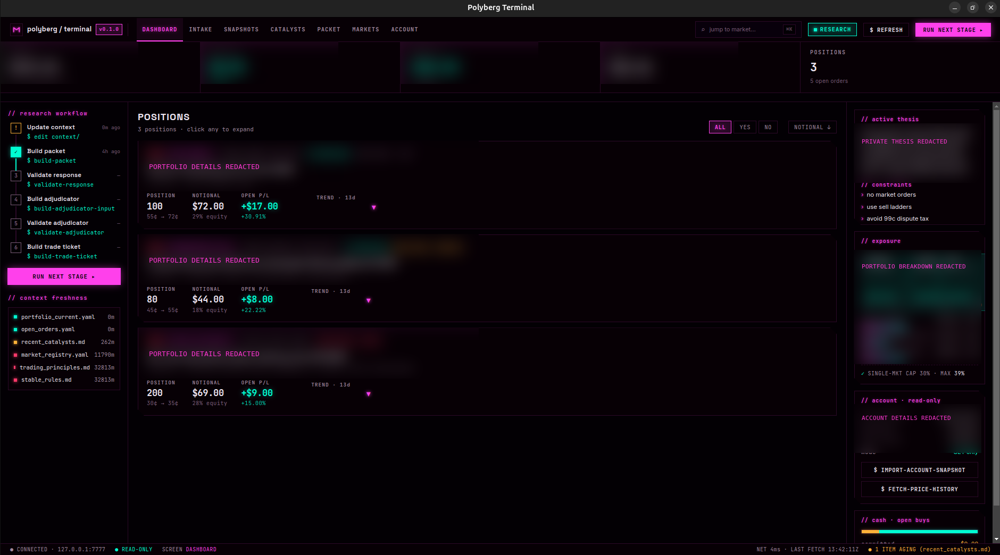
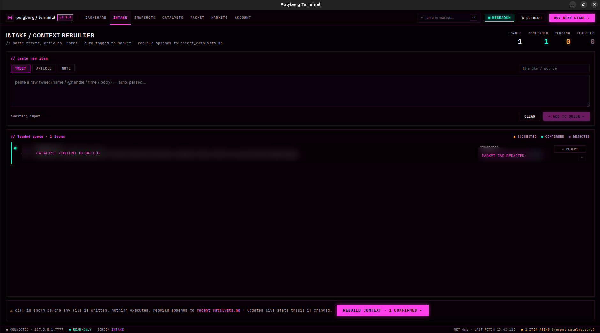
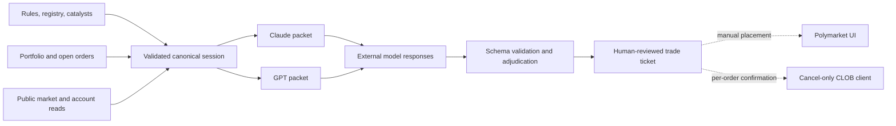

<h1 align="center">Polyberg</h1>

<p align="center">
  <strong>A local-first research and decision-support workbench for Polymarket.</strong>
</p>

<p align="center">
  Polyberg turns versioned market context into reproducible model briefs, validates
  structured responses, and keeps a human in control of every exchange action.
</p>

<p align="center">
  <a href="LICENSE"></a>
  
  
  
</p>

> [!IMPORTANT]
> Polyberg is research software, not financial advice or an autonomous trading
> system. It never submits orders. Its only exchange-side mutation is an
> isolated single-order cancellation path; the interactive and GUI workflows
> gate it per action.

## Overview

Prediction-market research gets difficult to audit when rules, headlines,
portfolio state, and model conversations live in one long prompt. Polyberg keeps
those inputs in small, versioned files and builds a validated
`canonical_session.json` before rendering any model-specific packet.

That design provides:

- **Reproducible research** — GPT, Claude, and legacy packet views are rendered
  from the same validated session state.
- **Traceable model hand-offs** — model responses, adjudication, and trade
  tickets have explicit JSON schemas and validation steps.
- **Local-first privacy** — the repository carries sample data while real
  portfolio and order state lives in gitignored local overlays.
- **Freshness and completeness checks** — stale context, missing pricing, and
  incomplete market metadata are surfaced before review.
- **Two working surfaces** — a Python CLI for automation and an Electron/React
  desktop application for day-to-day use.
- **A narrow action boundary** — order placements remain manual; interactive and
  GUI cancellation workflows present a separate confirmation for every order.

The project is intentionally model-provider agnostic. Polyberg prepares and
validates the artifacts; the user chooses how and where to run the external
models.

## Product tour

### Research dashboard

Positions, exposure, account state, context freshness, and the current research
stage are visible in one workspace.



### Catalyst intake

Tweets, articles, and notes enter through a review queue. Tweet-shaped pastes
are parsed into a source and body, then tagged to a registered market before any
context file is updated.



### Packet review

The packet screen exposes prerequisites, freshness warnings, generated model
context, and the next adjudication step without hiding the on-disk artifacts.


<sub>Private account, position, thesis, and catalyst details are blurred in the
portfolio-facing captures. The original UI composition and resolution are
preserved.</sub>

## How it works



Every packet-producing run writes a self-contained session:

```text
reports/sessions/<session_id>/
├── canonical_session.json
├── packet artifacts
└── manifest.json
```

The canonical payload is validated before anything is written. Packet artifacts
are then rendered from that payload, and `manifest.json` is written last to mark
the session complete. See the
[interface contract](docs/INTERFACE_CONTRACT.md) for the schema and failure
semantics.

## Quick start

### Requirements

- Python 3.11 or newer
- Node.js and npm for the desktop application
- Linux or Windows

### Install the Python workspace

```bash
python3.11 -m venv .venv
source .venv/bin/activate
python -m pip install --upgrade pip
python -m pip install -e ".[dev]"
```

On Windows PowerShell, activate the environment with:

```powershell
.\.venv\Scripts\Activate.ps1
```

No credentials are required to work with the tracked sample data. To enable
optional live reads, copy the environment template and add only the credentials
you need:

```bash
cp .env.example .env
```

Build model-specific research packets from the local context:

```bash
python -m polyberg.cli packet build --target all
```

The command writes GPT and Claude packet views plus a validated canonical
session. Generated sessions and packet outputs are gitignored.

### Run the desktop application

```bash
cd gui
npm ci
npm run dev
```

Build a desktop distribution with `npm run dist`.

## Typical research loop

1. **Curate context.** Add or update resolution rules, market metadata, thesis
   notes, and catalysts.
2. **Refresh state.** Optionally import public positions, CLOB balances, open
   orders, price history, and order books through the read-only collectors.
3. **Build a session.** Polyberg validates local inputs, records one canonical
   state artifact, and renders model-specific packets.
4. **Run external reviews.** Give the same factual session to a trader prompt
   and a risk prompt, then save their structured responses.
5. **Validate and adjudicate.** Reject malformed output before it reaches the
   adjudicator or trade-ticket builder.
6. **Decide manually.** Review the final ticket and place any order yourself.
   The ladder tool can prepare a reconciliation plan; its interactive and GUI
   workflows confirm cancellations one at a time.

## Selected CLI commands

Run `python -m polyberg.cli --help` for the complete command surface.

| Task | Command |
|---|---|
| Build GPT and Claude packets | `python -m polyberg.cli packet build --target all` |
| Build the legacy combined packet | `python -m polyberg.cli build-packet` |
| Fetch read-only order books | `python -m polyberg.cli fetch-books` |
| Snapshot registered markets | `python -m polyberg.cli snapshot-markets` |
| Discover markets | `python -m polyberg.cli search-markets --query "..."` |
| Register a market | `python -m polyberg.cli registry-add --url <polymarket-url>` |
| Import read-only account state | `python -m polyberg.cli import-account-snapshot` |
| Validate a model response | `python -m polyberg.cli validate-response <response.json>` |
| Build adjudicator context | `python -m polyberg.cli build-adjudicator-input ...` |
| Render a trade ticket | `python -m polyberg.cli build-trade-ticket ...` |
| Preview ladder reconciliation | `python -m polyberg.cli ladder plan` |
| Evaluate event-level payoff | `python -m polyberg.cli hedge` |

## Safety model

| Capability | Support |
|---|---|
| Read public market data | Yes |
| Read positions, balances, and open orders | Yes, with optional credentials |
| Generate and validate research artifacts | Yes |
| Submit or amend orders | **No** |
| Cancel an open order | Isolated path; interactive and GUI workflows confirm per order |
| Store or use wallet private keys | **No** |
| Auto-execute model output | **No** |
| Browser automation | **No** |

The canonical session pins `mode: "research_only"` and
`execution_allowed: false` through Pydantic literals, JSON Schema constants, and
construction-time invariants. The cancel-only client is separate from the
GET-only account client and cannot place an order. The detailed credential and
request model is documented in
[Read-Only Account Connection](docs/account_connection.md).

## Local data and privacy

Tracked context files contain sample data so a fresh clone is usable. Promotion
commands write real positions and orders to gitignored siblings:

| Tracked sample | Private local overlay |
|---|---|
| `context/portfolio_current.yaml` | `context/portfolio_current.local.yaml` |
| `context/open_orders.yaml` | `context/open_orders.local.yaml` |
| `live/target_ladders.yaml` | `live/target_ladders.local.yaml` |

Credentials belong in `.env`, which is also gitignored. Canonical sessions,
generated reports, live order books, and the append-only order log are excluded
from version control because they can reveal account activity.

Use the import and promotion commands instead of copying real account data into
the tracked sample files. See
[Read-Only Account Connection](docs/account_connection.md) for setup details.

## Project structure

```text
src/polyberg/
├── packet_builder/   # canonical session collection and packet renderers
├── collectors/       # public and authenticated read-only data clients
├── ladder/           # reconciliation, validation, and cancel-only execution
├── cli.py            # Python command surface
└── validators.py     # JSON Schema and cross-field validation

gui/                  # Electron, React, and TypeScript desktop application
context/              # rules, catalysts, registry, and sample state
prompts/               # trader, risk, and adjudicator prompt contracts
schemas/              # versioned JSON Schema contracts
tests/                # Python unit and integration-style tests
docs/                 # interface and account-connection documentation
design/               # design notes and screenshots
```

## Development

```bash
# Python
make test
make lint

# Desktop application
cd gui
npm run typecheck
npm test
```

The Python tests use injected HTTP fakes for collectors and ladder actions; they
do not place real orders. GUI tests run with Vitest.

## Improvement blueprint

The highest-value next steps are deliberately weighted toward reliability and
portfolio readiness before adding more surface area:

1. **Establish a green CI quality gate.** Run the Python suite, Ruff, TypeScript
   checks, Vitest, and production builds on every pull request; add an opt-in
   smoke test for live market snapshots.
2. **Create a deterministic demo mode.** Ship a synthetic research session and
   automate privacy-safe screenshot capture so product documentation never
   depends on personal portfolio data.
3. **Unify private-overlay handling.** Route every private context type through
   one resolver and add a repository check that rejects accidental wallet,
   position, or generated-session data.
4. **Harden the external contracts.** Reconcile the documented cancel exception,
   add contract tests around CLOB request signing, and version any future schema
   changes with migrations.
5. **Improve research measurement.** Archive aged catalysts automatically,
   capture the market price at intake time, and backtest signal accuracy and
   source quality after resolution.
6. **Add release engineering.** Provide a first-class `polyberg` CLI entry point,
   versioned changelogs, and reproducible Electron installers for supported
   platforms.

The working backlog and implementation notes live in [TODO.md](TODO.md).

## License

Polyberg is available under the [MIT License](LICENSE).
