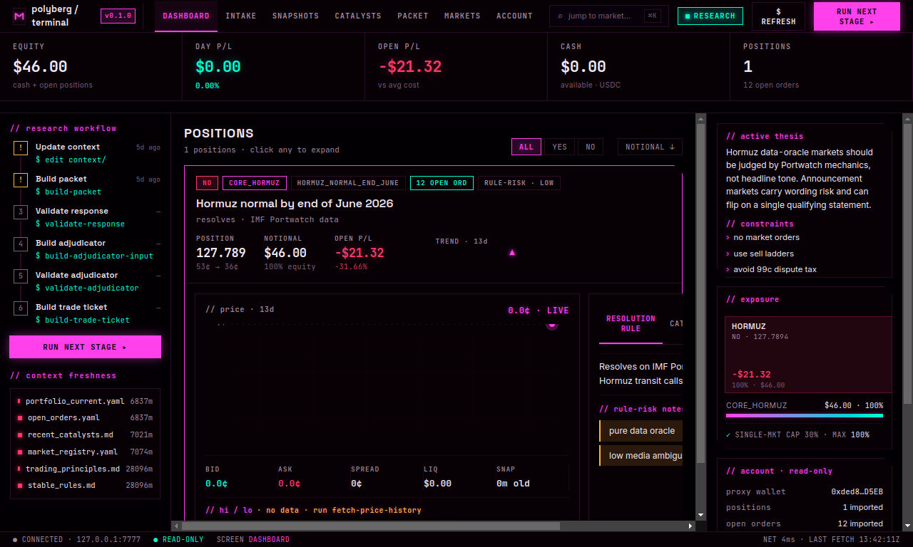
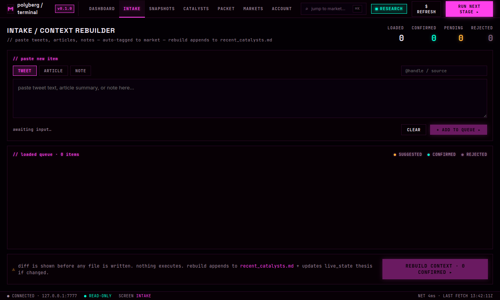
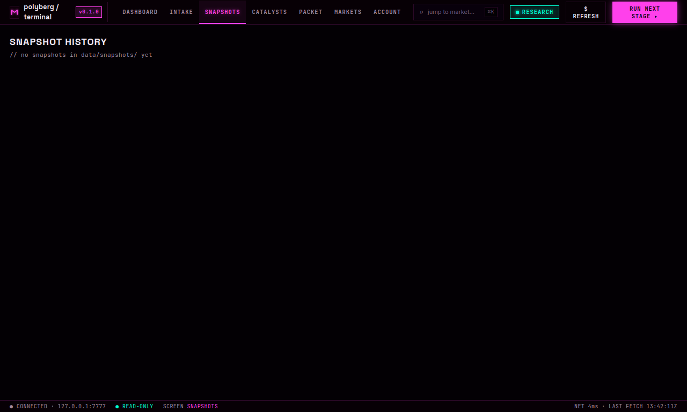
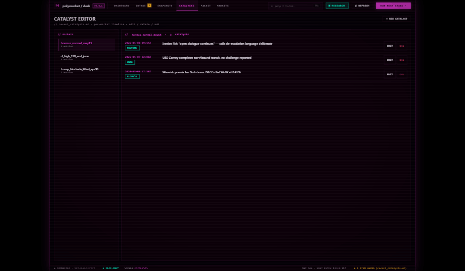
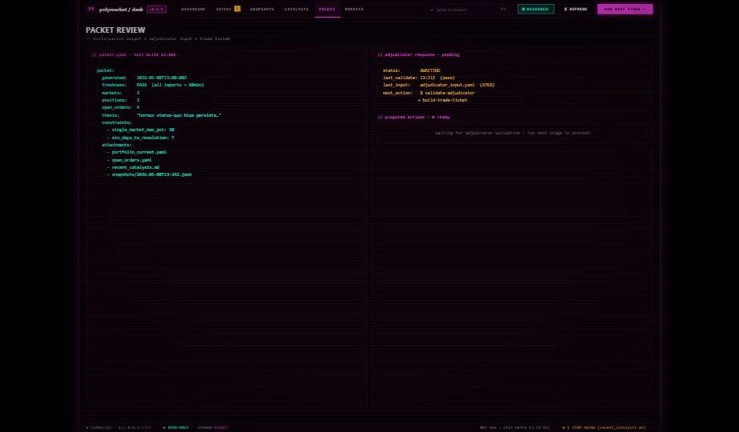
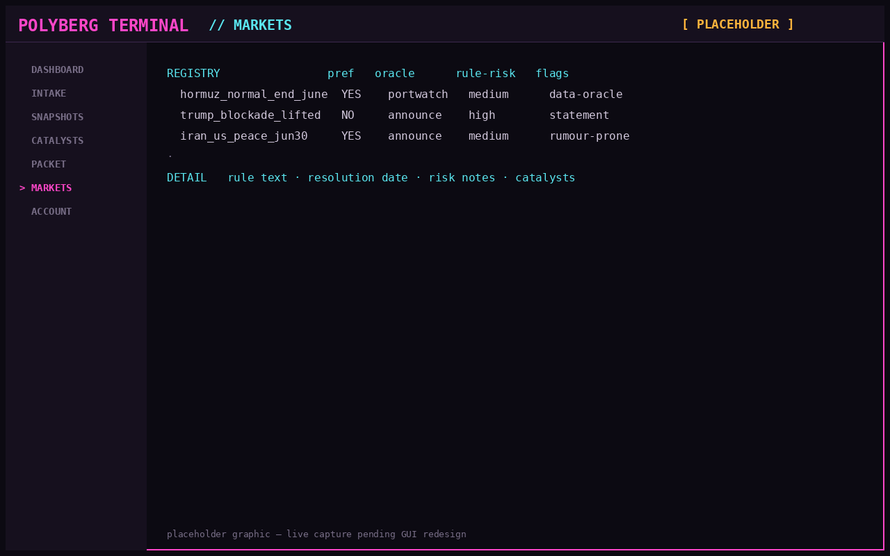

# Polyberg

A local-first research workbench for Polymarket. You keep your rules, thesis,
portfolio state, prompts, and schemas in versioned files. Polyberg builds a
deterministic packet from them, runs it through an LLM trader prompt + a risk
prompt + an adjudicator, validates every JSON artifact against a schema, and
renders a human-readable trade ticket. You place the trade yourself —
Polyberg never touches the exchange.

Built and iterated on with Claude Code and Codex. The file-based design is
deliberate: it makes those agents (and humans) effective at editing the
project predictably.

[](LICENSE)


---

## Why the file-based design

Mash your whole trading context into one giant prompt and you can't tell
where a bad call came from later. Polyberg splits everything into small
versioned files: stable resolution rules in one place, your thesis in
another, the catalyst log somewhere else, the market registry alongside.
Each LLM stage takes a deterministic packet built from those files, returns
structured JSON, and gets validated against a local schema before the next
stage runs.

What that buys you:

- You can diff context between runs and trace any model decision back to
  its inputs.
- A model can't smuggle a free-form opinion past the pipeline — it has to
  pass a schema or it gets rejected.
- An adjudicator stage compares two model outputs against the same packet,
  so a human reviews a structured disagreement instead of two raw opinions.
- The Python CLI and the Electron GUI call the same builders, so the
  workflow is identical whether you live in a terminal or want a desk app.

## Screens

**Dashboard** — positions, freshness audit, research workflow, account rail.



**Intake / context rebuilder** — paste tweets, articles, notes; auto-tag to
markets; diff before any file is written.



**Snapshots** — structured market-snapshot scaffold with diff against prior
captures. The live Gamma/CLOB collector wiring isn't done yet; today
`snapshot-markets` emits the schema with placeholder prices.



**Catalysts** — manually curated `recent_catalysts.md` viewer with
attribution.



**Packet review** — generated `packet.md` next to adjudicator status and
next stage.



**Markets** — registry view with rule keys, oracle types, and resolution
risk flags.



---

## Safety boundary — read before configuring credentials

| Capability                | Status               |
|---------------------------|----------------------|
| Read Polymarket public API| ✅ supported         |
| Read CLOB balances/orders | ✅ via L2 HMAC (GET) |
| Place / cancel orders     | ❌ never             |
| Hold wallet private keys  | ❌ never             |
| Auto-execute model output | ❌ never             |
| Browser automation        | ❌ never             |
| Scrape websites           | ❌ never             |

Authenticated reads use a pre-minted `(api_key, secret, passphrase)` triple
plus the signer EOA address. You mint that triple **once**, using
`py-clob-client` from a scratch directory outside this repo, and paste the
result into `.env`. Polyberg never sees your wallet's private key. There's
also an optional Polymarket US API key/secret pair for that tenant — both
paths are GET-only. Full credential model is in
[`docs/account_connection.md`](docs/account_connection.md).

If you want to verify: grep the codebase for `eth_account`,
`web3.eth.account`, or anything that signs an L1 transaction. You won't
find it.

## Known gaps (so you're not surprised)

- `snapshot-markets` emits the snapshot schema with placeholder prices.
  Wiring it to the live Gamma/CLOB collectors is a follow-up.
- The GUI's catalyst viewer doesn't parse `recent_catalysts.md` into
  per-market rows yet — it shows an empty list.
- The Python CLI doesn't apply `*.local.yaml` overlays. Only the GUI does,
  and only for `live_state.yaml`. See *Local-only overlays* below.
- The generic stage-runner button in the GUI doesn't pass per-stage args,
  so commands like `validate-response` and `build-adjudicator-input` need
  to be run from the CLI for now.

## Install — Ubuntu / Linux

Ubuntu is the primary runtime target, so this path is the most exercised.

```bash
python3.11 -m venv .venv
source .venv/bin/activate
python -m pip install --upgrade pip
pip install -e ".[dev]"
pytest
```

The editable install isn't cosmetic — it's the reason package-relative
defaults (`context/`, `schemas/`, `reports/generated/`) resolve to this
repo at runtime instead of wherever pip decided to drop the package.

## Install — Windows PowerShell

```powershell
py -3.11 -m venv .venv
.\.venv\Scripts\Activate.ps1
python -m pip install --upgrade pip
pip install -e ".[dev]"
pytest
```

Windows works for local editing and testing, but Linux gets more soak
time. If something behaves weirdly on Windows, file an issue.

## Configure credentials

```bash
cp .env.example .env
```

Everything in `.env` is optional. Polyberg degrades gracefully — missing a
CLOB key just means the authenticated import commands won't work; the rest
of the workflow keeps running on local files. The CLI auto-loads `.env`
from the repo root on every invocation (including the stages the Electron
GUI spawns). Real shell-env values always win over `.env`, so a CI/systemd
setup that injects credentials differently is unaffected.

## Local-only overlays — the most common footgun

The tracked files in `context/` ship with **sample data** because this
repo is public. Your real portfolio, your real wallet, and your real
catalyst log should never get committed.

The pattern: drop your real data into gitignored sibling files.

| Sample (tracked)              | Real data (gitignored)              |
|-------------------------------|-------------------------------------|
| `context/live_state.yaml`     | `context/live_state.local.yaml`     |
| `context/portfolio_current.yaml` | `context/portfolio_current.local.yaml` |
| `context/open_orders.yaml`    | `context/open_orders.local.yaml`    |
| `context/recent_catalysts.md` | `context/recent_catalysts.local.md` |

Only `live_state.local.yaml` is auto-merged, and only by the GUI. The
Python CLI reads the tracked files directly — overlays aren't wired in
yet. So for the rest, the `.local.*` files are your **private reference
copy**. To actually run a packet against your real data from the CLI,
either:

1. Restore the real content into the tracked files locally and run
   `git update-index --skip-worktree context/portfolio_current.yaml
   context/open_orders.yaml context/recent_catalysts.md` so git stops
   showing them as modified, or
2. Use the GUI's import / promote flow, which writes directly to the
   tracked files — then make sure not to commit those writes.

Don't paste real positions into the tracked files and then `git add .`.

## Running the GUI

```bash
cd gui
npm install
npm run dev
```

Build a distributable:

```bash
cd gui
npm run build
```

## CLI workflow

The Makefile covers the common path:

```bash
make install
make test
make lint
make packet
make clean
```

Plain Python equivalents work on Bash and PowerShell:

```bash
python -m pip install -e ".[dev]"
pytest
ruff check src tests
```

### Full pipeline, stage by stage

Each stage is deliberately separated — you can stop, inspect the
artifact on disk, and resume:

```bash
# 1. (Optional) Snapshot the markets you care about.
# Reminder: see "Known gaps" — this emits placeholder prices today.
python -m polyberg.cli snapshot-markets \
  --output data/snapshots/markets_YYYY-MM-DD_HHMM.json

# 2. (Optional) Pull read-only account data.
python -m polyberg.cli import-public-positions --address 0x... \
  --output reports/generated/account_positions_raw.json
python -m polyberg.cli import-clob-orders \
  --output reports/generated/account/open_orders_raw.json
python -m polyberg.cli import-clob-balance \
  --output reports/generated/account/balance.json
python -m polyberg.cli import-account-snapshot \
  --output-dir reports/generated/account

# 3. Build the packet from local context + (optional) snapshot.
python -m polyberg.cli build-packet \
  --snapshot data/snapshots/markets_YYYY-MM-DD_HHMM.json \
  --output reports/generated/packet.md

# 4. Paste packet.md into your trader prompt, save model JSON to
#    reports/generated/claude_output.json. Repeat for the risk prompt
#    -> reports/generated/chatgpt_output.json.

# 5. Validate both model outputs against the trade-response schema.
python -m polyberg.cli validate-response reports/generated/claude_output.json
python -m polyberg.cli validate-response reports/generated/chatgpt_output.json

# 6. Build the adjudicator input: packet + both model outputs.
python -m polyberg.cli build-adjudicator-input \
  --packet reports/generated/packet.md \
  --model-output-a reports/generated/claude_output.json \
  --model-output-b reports/generated/chatgpt_output.json \
  --output reports/generated/adjudicator_input.md

# 7. Paste that into the adjudicator model; save JSON to
#    reports/generated/adjudicator_output.json, then validate.
python -m polyberg.cli validate-adjudicator reports/generated/adjudicator_output.json

# 8. Render the human-readable trade ticket.
python -m polyberg.cli build-trade-ticket \
  --adjudicator-output reports/generated/adjudicator_output.json \
  --output reports/generated/trade_ticket.md
```

Read the trade ticket. Decide. Place the trade on Polymarket yourself.

## Repository layout

```
context/        # editable inputs: rules, principles, catalysts, registry, state
prompts/        # LLM prompt templates
schemas/        # JSON schemas — outputs are untrusted until they pass these
src/polyberg/   # Python CLI + collectors + builders + validators
gui/            # Electron desktop GUI (TypeScript / React)
docs/           # account-connection docs
data/snapshots/ # generated market snapshots (gitignored)
reports/        # generated packets, adjudicator I/O, trade tickets (gitignored)
tests/          # pytest suite (108 tests)
```

The naming conventions exist to help humans (and now AIs) find things
predictably. `context/` is the only directory you should edit by hand
during normal use.

## Context files

`context/stable_rules.md` covers durable resolution-rule notes —
explanations for each `rule_key` referenced in the registry.
`context/trading_principles.md` holds standing trading discipline that
the model has to acknowledge (no market orders, sell ladders, that kind
of thing). `context/recent_catalysts.md` is a manually curated log of
catalysts you want the model to see — feed it via the GUI's Intake tab
or edit it directly. `context/live_state.yaml` carries current mode,
constraints, watchlist, and account snapshot. `context/portfolio_current.yaml`
and `context/open_orders.yaml` are exactly what they sound like.
`context/market_registry.yaml` is the stable list of markets you trade,
with rule keys, oracle types, and resolution risk flags — the model uses
those to decide how seriously to take a given headline. Sample entries
reference example markets like `hormuz_normal_may15` so you can see the
file shape without setting up real data.

## Prompts and schemas

`prompts/claude_trader_prompt.md` is the aggressive idea generator.
`prompts/chatgpt_risk_prompt.md` is the resolution-rules critic.
`prompts/adjudicator_prompt.md` compares the two against the packet.
Schemas under `schemas/` validate every JSON artifact in the pipeline —
model output, adjudicator output, market snapshots. The
`twitter_sentiment_response.schema.json` schema is reserved for a future
Grok/Twitter integration; nothing implements it today, and if it lands
it'll be catalyst-only and non-authoritative.

## Things worth knowing

- **Linux first, Windows second.** Both work; Linux gets more soak time.
- **All paths use `pathlib`.** Timestamps are Windows-safe
  (`2026-04-26_0900` — no colons).
- **Schema validation is non-negotiable.** Model outputs are untrusted
  until they pass `jsonschema` + `rfc3339-validator`, with extra Python
  checks that require timezone-aware `as_of` fields.
- **Twitter/X sentiment is catalyst-only.** Never resolution evidence.
- **Override the timezone with `POLYBERG_TIMEZONE`** (default
  `America/Edmonton`).
- **Override the freshness warning with `POLYBERG_MAX_CONTEXT_AGE_HOURS`**
  (default 36).
- **Every order recommendation needs human review.** Not a soft rule.

## Out of scope

Automated trading. Live order placement. MCP. Wallet private-key handling.
Browser automation. Scraping. Treating Twitter/X as fact. Polyberg
prepares clean context and enforces structured outputs — it's research
infrastructure, not an execution system.

## License

MIT — see [LICENSE](LICENSE).
